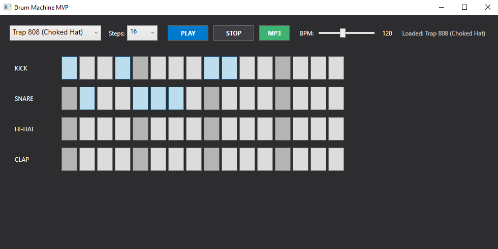

Программа для создания сэмплов из ударных. В документации представлены: диаграмма классов (рисунок 1) и скриншот программы (рисунок 2).
## 1. Описание проблемы предметной области

В разработке секвенсора ударных ключевой задачей является переключение между различными музыкальными наборами. Сложность предметной области заключается в том, что разные музыкальные жанры требуют не просто загрузки разных звуковых `.wav` файлов, но и **различных алгоритмов воспроизведения**:

*   **Acoustic Rock**: требуется стандартная полифония (наложение звуков). Звуки должны затухать естественно, не прерываясь новыми ударами.
*   **Trap 808**: требует принудительного глушения хай-хэта (механика Choke Group). Каждый новый удар по хэту должен мгновенно останавливать предыдущий, чтобы избежать перегруза низких частот.
*   **Synthwave**: требует программной генерации задержки (эффект Echo на рабочем барабане) для воссоздания ретро-звучания 80-х.

Если реализовывать выбор файлов и проверку алгоритмов воспроизведения внутри главного цикла таймера (в слое UI), возникает сильная связность кода. Метод воспроизведения превращается в антипаттерн, состоящий из перегруженных `if-else` проверок. Это нарушает принцип **единственной ответственности** и принцип **открытости/закрытости**, делая невозможным масштабирование системы без модификации существующего рабочего кода.

## 2. Решение: использование паттерна

Для решения проблемы применен порождающий паттерн **Фабричный метод**.

Был определен интерфейс создателя **`IKitFactory`**, который устанавливает контракт на производство музыкального набора через метод `CreateKit()`. Каждая конкретная фабрика (**`TrapKitFactory`**, **`RockKitFactory`**, **`SynthwaveKitFactory`**) реализует этот интерфейс, инкапсулируя в себе логику создания соответствующего продукта.

Продуктом выступает абстрактный класс **`DrumKit`**. В отличие от простой загрузки данных, здесь фабричный метод позволяет возвращать объекты с различным внутренним поведением (полиморфизм алгоритмов). Клиентский код (**`MainWindow`**) полностью изолирован от знаний о файловой системе и специфических аудио-эффектах. Он оперирует списком интерфейсов `IKitFactory` и при смене жанра просто вызывает метод `CreateKit()`, получая готовый объект с нужной логикой внутри.

## 3. Диаграмма классов и скриншот

Рисунок 1

Рисунок 2

## 4. Вывод
Внедрение паттерна «Фабричный метод» оказало следующее влияние на работу и структуру программы:

Слабая связанность: Логика формирования путей к файлам и специфических аудио-эффектов вынесена из класса MainWindow. Интерфейс теперь "не знает" о существовании конкретных файлов на диске.

Масштабируемость: Добавление нового музыкального жанра (например, Techno или EDM) теперь требует создания только двух новых классов (Продукт и Фабрика) без изменения существующего кода секвенсора.

Инкапсуляция поведения: Различия в воспроизведении (монофония, эхо, наложение) теперь скрыты внутри соответствующих классов-наборов. Это позволило сделать основной цикл программы чистым и независимым от типа выбранного инструмента.
