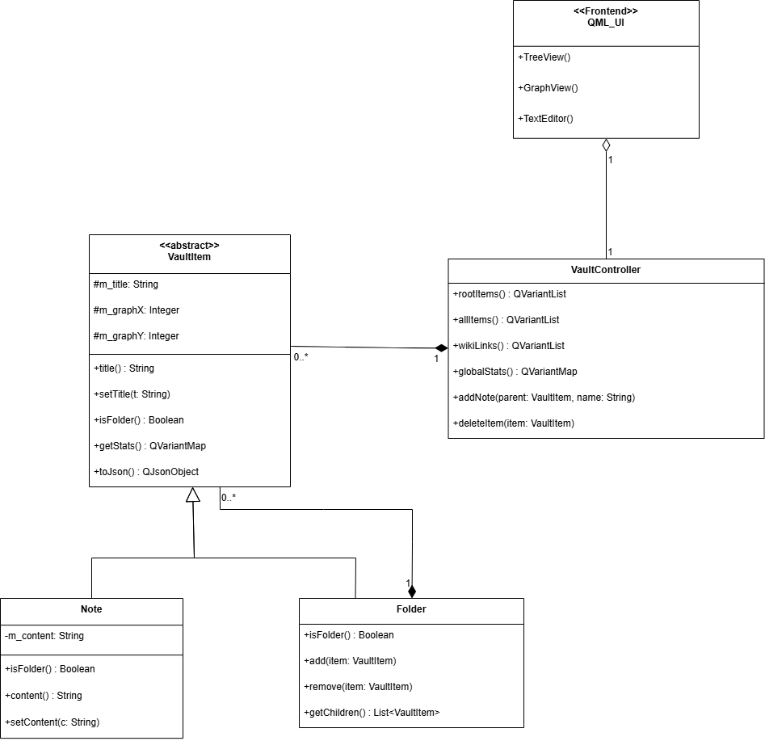

Программа для создания и управления связанными заметками. Проект демонстрирует применение структурных паттернов проектирования для работы с древовидными иерархиями данных, а также визуализацию графа связей.

## 1. Описание проблемы предметной области

В разработке систем управления знаниями (файловых менеджеров, редакторов заметок) ключевой задачей является организация контента. Хранилище (Vault) состоит из единичных файлов (Заметок) и контейнеров (Папок). При этом папки могут содержать в себе как заметки, так и другие папки, образуя дерево бесконечной вложенности.

Сложность предметной области заключается в необходимости выполнять **групповые операции** над ветвями этого дерева. Например, приложению нужно подсчитать суммарную статистику (количество слов и символов) для всего хранилища, рекурсивно сохранить все данные в JSON или отрисовать линии связей на графе.

Если реализовывать эту логику на стороне контроллера или UI, коду придется использовать громоздкие рекурсивные алгоритмы с постоянной проверкой типов: `if (item is Folder) { ... } else if (item is Note) { ... }`. Это приводит к жесткой связанности кода, нарушает принцип открытости/закрытости и делает невозможным добавление новых типов контента (например, «Холст» или «PDF-документ») без переписывания ядра программы.

## 2. Решение: как используется паттерн в проекте

Для элегантного решения проблемы применен структурный паттерн **Компоновщик (Composite)**. Он позволяет сгруппировать объекты в древовидные структуры и работать с одиночными объектами и их группами абсолютно единообразно.

*   **Component (`VaultItem`)**: Абстрактный базовый класс, задающий общий контракт для всех элементов хранилища. Он объявляет методы, необходимые системе: `toJson()` для сохранения и базовые свойства координат (`graphX`, `graphY`) для графа.
*   **Leaf (`Note`)**: Конечный элемент. Не имеет вложенных элементов. Его реализация `toJson()` просто сериализует собственный текст и заголовок в JSON-объект.
*   **Composite (`Folder`)**: Составной элемент. Содержит внутри себя вектор дочерних `VaultItem`. Главная особенность паттерна раскрывается в его реализации методов: например, при вызове `toJson()` папка создает JSON-массив, рекурсивно опрашивает всех своих «детей» (не зная, заметки это или другие папки), просит их превратиться в JSON и складывает в общий массив.

Клиентский код (`VaultController` и QML-интерфейс) полностью изолирован от сложностей иерархии. Чтобы сохранить весь проект на жесткий диск, контроллеру достаточно вызвать `toJson()` у корневых элементов. Паттерн Компоновщик берет весь рекурсивный обход дерева на себя.

## 3. Архитектура системы

### Рисунок 1 — Диаграмма классов

## 4. Вывод
С паттерном добавление нового элемента (например, TodoListItem или ImageItem) требует только создания нового класса. Старый код (статистика, сохранение, UI) вообще не меняется. Без паттерна нужно будет переписывать каждый метод в контроллере и QML.
Программа работает с одним базовым типом VaultItem вместо 2-х, 3-х или 10-ти. Это на порядок снижает количество багов.
Логика обхода иерархии «спрятана» внутри самой структуры данных. Контроллер перестал быть «нянькой», которая знает всё про всех, и стал просто запрашивать результат у корневого объекта.
Графический интерфейс освобожден от «мусора» — он просто отображает дерево, не вникая в то, как связаны папки и файлы под капотом.
