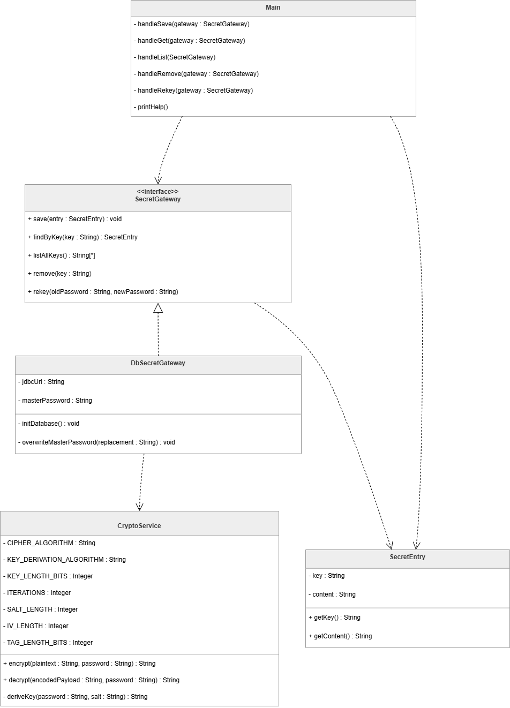

Консольное приложение для безопасного хранения конфиденциальных данных (паролей, API-ключей, заметок) с использованием прозрачного шифрования и паттерна **Gateway (Шлюз)**.

## 1. Описание проблемы

При разработке приложений, работающих с чувствительными данными, возникают две основные сложности:
1.  **Безопасность хранения:** Данные нельзя хранить в открытом виде. Необходимо внедрять механизмы симметричного шифрования (например, AES-256), управление солями (Salt) и векторами инициализации (IV).
2.  **Связность кода (Coupling):** Если смешать логику пользовательского интерфейса (CLI), криптографические алгоритмы и SQL-запросы к базе данных в одном месте, код становится крайне сложным для тестирования и поддержки. 

Любое изменение в схеме БД или замена алгоритма шифрования при такой архитектуре потребует переписывания всей бизнес-логики приложения.

## 2. Решение: Использование паттерна Gateway

Для решения указанных проблем в проекте реализован паттерн **Gateway (Шлюз к таблице данных)**. 

### Как паттерн используется в проекте:
*   **Абстракция доступа:** Создан интерфейс `SecretGateway`, который определяет контракт для работы с секретами (`save`, `findByKey`, `listAllKeys`, `rekey`). Бизнес-логика (класс `Main`) взаимодействует только с этим интерфейсом.
*   **Инкапсуляция сложности:** Реализация `DbSecretGateway` берет на себя всю «грязную» работу:
    *   Управление JDBC-соединениями с портативной БД H2.
    *   Выполнение SQL-запросов (MERGE, SELECT, DELETE).
    *   **Прозрачное шифрование:** Перед сохранением данных в БД Шлюз обращается к `CryptoService` для шифрования контента (AES-256 GCM). При чтении — расшифровывает данные обратно.
*   **Прозрачность данных:** Для основного приложения данные выглядят как обычные строки. Шифрование происходит незаметно внутри шлюза в момент пересечения границы между оперативной памятью и постоянным хранилищем.

## 3. Диаграмма классов

## 4. Вывод: влияние паттерна на работу программы

Внедрение паттерна Gateway позволило достичь следующих результатов:

1.  **Чистота бизнес-логики:** Класс `Main` сократился до обработки команд пользователя. В нем полностью отсутствуют низкоуровневые детали работы с криптографией и базами данных.
2.  **Легкая заменяемость хранилища:** Если потребуется заменить БД H2 на MongoDB или облачное хранилище, достаточно создать новую реализацию `SecretGateway`. Остальной код программы (90% проекта) останется неизменным.
3.  **Централизованная безопасность:** Логика шифрования сосредоточена в одном месте — внутри шлюза. Это гарантирует, что данные никогда не попадут в базу в открытом виде по ошибке разработчика, так как единственный путь к БД лежит через защищенный шлюз.
4.  **Упрощение транзакционной логики:** Сложные операции, такие как `rekey` (полное перешифрование базы при смене мастер-пароля), изолированы внутри шлюза и защищены транзакциями БД, что предотвращает потерю данных при сбоях.
